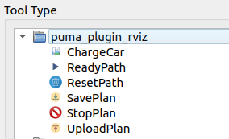

# Puma Plugin Rviz

## Resumen

Paquete ROS noetic se centra en la creación de plugins rviz para facilitar el control de los waypoints (**`puma_waypoints`**).

## Instalación

Se realiza compilación por [catkin_tools](https://catkin-tools.readthedocs.io/en/latest/):

    catkin build puma_plugin_rviz

#### Dependencias

- [Robot Operating System (ROS)](http://wiki.ros.org)
- [roscpp](http://wiki.ros.org/roscpp)
- [rviz](http://wiki.ros.org/rviz)
- [std_msgs](http://wiki.ros.org/std_msgs)

## Plugins

Una vez compilado aparecerá una nueva agrupación en rviz con los nuevos botones:

  

### ReadyPath

Envía una señal a la máquina de estados de **`puma_waypoints`** para iniciar la planificación de rutas marcadas, o para repetir el mismo plan una vez completado. (En estado `path_select`)

#### Publicador

- **`/puma/waypoints/plan_ready`** (std_msgs/Empty)

### ResetPath

Envía una señal para borrar las rutas planteadas (en el estado `path_select`) o para volver a la selección de rutas una vez se encuentre completada la ruta (en el estado `path_complete`).

#### Publicador

- **`/puma/waypoints/plan_reset`** (std_msgs/Empty)

### StopPlan

Envía una señal para la detención del seguimiento de rutas (en el estado `path_follow`) o para la detención en el seguimiento de la base de carga (en el estado `charge_mode`).

#### Publicador

- **`/puma/waypoints/plan_stop`** (std_msgs/Empty)

### ChargeCar

Envía una señal para el seguimiento de la base de carga una vez completada la ruta (en el estado `path_completed`) o cuando se esta seleccionando la ruta (en el estado `path_select`).

#### Publicador

- **`/puma/waypoints/run_charge_mode`** (std_msgs/Empty)

### SavePlan

Envía una señal para guardar la ruta planteada actual cuando se encuentra en el estado `path_select`. En caso se haber otro plan guardado anteriormente, se sobreescribe.

#### Publicador

- **`/puma/waypoints/plan_save`** (std_msgs/String, data: "default_plan")

### UploadPlan

Envía una señal para cargar una ruta cuando se encuentra en el estado `path_select`. La ruta debe de tener el nombre `default_plan`.

- **`/puma/waypoints/plan_upload`** (std_msgs/String, data: "default_plan")
